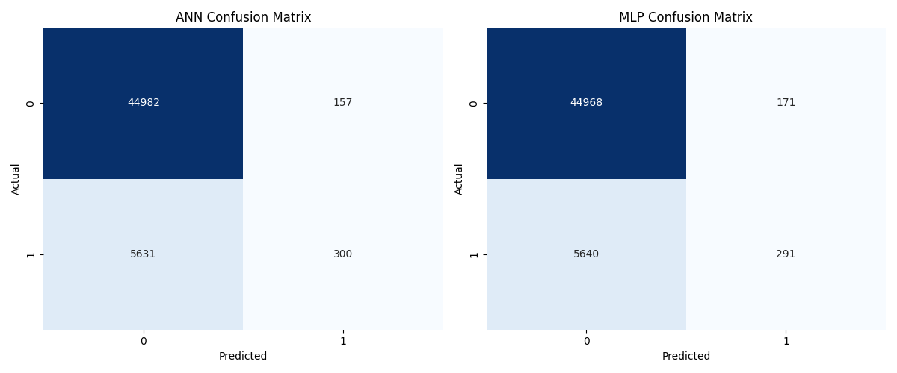
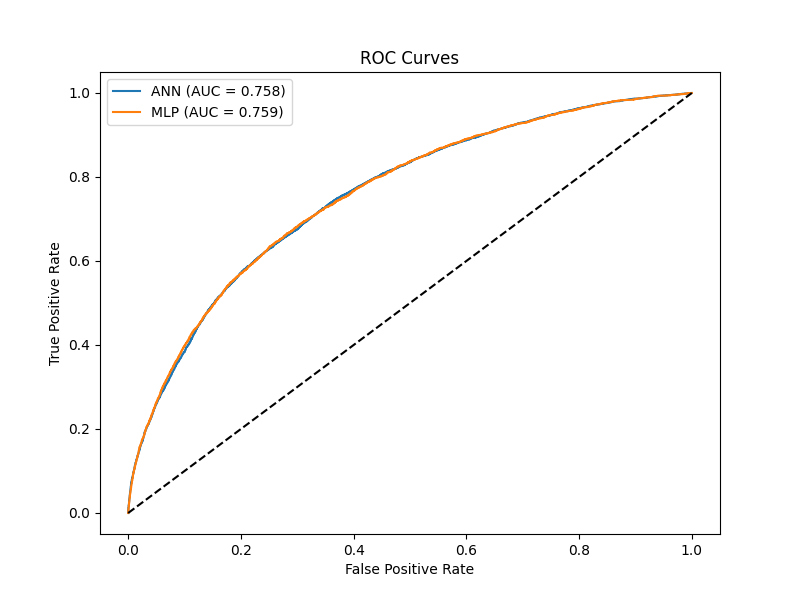
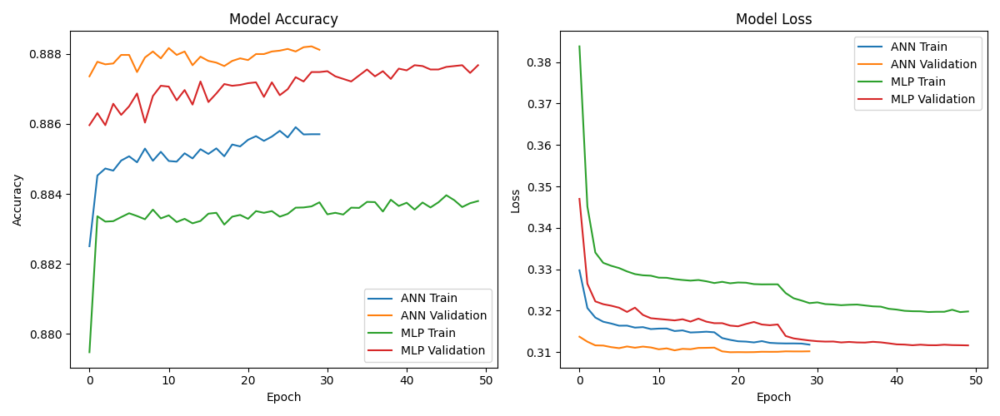

 🏦 Bank Loan Default Predictor

 📚 Overview

The **Bank Loan Default Predictor** is a machine learning project that predicts the likelihood of a borrower defaulting on a loan. The project uses deep learning models, such as Artificial Neural Networks (ANN) and Multi-layer Perceptron (MLP), to analyze borrower details and loan information for smarter lending decisions.

This repository contains the code, model training, and evaluation results for loan default prediction, aimed at assisting financial institutions in making better, data-driven lending decisions.

- **Project URL:** [Bank Loan Default Predictor on GitHub](https://github.com/scorpion-123/bank-loan-default-predictor)

---

 🔎 Problem Statement

Banks and financial institutions need to assess the risk of loan default before approval. The **Bank Loan Default Predictor** utilizes deep learning techniques to predict the probability of a borrower defaulting, providing valuable insights for lenders to make informed decisions.

---

 ✨ Features

- Predicts loan default probability using ANN and MLP models.
- Includes preprocessing of borrower data (such as age, income, credit score, etc.) and loan details.
- Provides model evaluation metrics like accuracy, ROC-AUC, confusion matrix, and more.

---

 📊 Model Performance

- **ANN:** Achieved high performance with an accuracy of ~88.8% and AUC of 0.758.
- **MLP:** Similar performance to ANN with AUC of 0.759.
  

#### Confusion Matrices


- **ANN:** Achieved high performance with an accuracy of ~88.8% and AUC of 0.758.
- **MLP:** Similar performance to ANN with AUC of 0.759.

#### ROC Curves


The models show good convergence and minimal overfitting, making them reliable for loan default prediction tasks.

#### Model Training History



The models show good convergence and minimal overfitting, making them reliable for loan default prediction tasks.

---

 🚀 How to Run

 1. Clone the Repository

```bash
git clone https://github.com/scorpion-123/bank-loan-default-predictor.git
cd bank-loan-default-predictor
```

 2. Set Up the Virtual Environment

```bash
python -m venv venv
source venv/bin/activate   On Windows: venv\Scripts\activate
```

 3. Install Dependencies

```bash
pip install -r requirements.txt
```

 4. Run the Application

```bash
streamlit run app.py
```

---

 🛠️ Technologies Used

- **Python 3.8+**
- **PyTorch** (for deep learning models: ANN, MLP)
- **scikit-learn** (for model evaluation and preprocessing)
- **Pandas & NumPy** (data manipulation)
- **Matplotlib & Seaborn** (data visualization)
- **Streamlit** (interactive web interface)

---

 📈 Results

| Model          | AUC    | Accuracy | True Negatives | True Positives |
|----------------|--------|----------|----------------|----------------|
| **ANN**        | 0.758  | ~88.8%   | 44,982         | 300            |
| **MLP**        | 0.759  | ~88.8%   | 44,968         | 291            |

---

 🔮 Future Work

- Enhance model performance with more advanced techniques (e.g., XGBoost, Random Forest).
- Integrate explainable AI techniques (SHAP, LIME) for model transparency.
- Improve real-time predictions through API deployment for use by financial institutions.

---

 👥 Team Members

| Name       
|-------------|
Member 1       Md Arham(56)
Member 2       Arkaprabha Banerjee(57)
Member 3       Ankit Dey(58)
Member 4       Ritam Ghosh(60)
Member 5       Maitreya Chakraborty (61)
---

 📎 References

- [Machine Learning for Credit Risk Modeling - ResearchGate](https://www.researchgate.net/publication/335412745_Machine_Learning_for_Credit_Risk_Modeling)
- [Loan Default Prediction using ANN - GitHub](https://github.com/rajneeshvsht/Loan-Default-Prediction-using-Artificial-Neural-Networks)
- [Credit Default Prediction using Deep Learning - ScienceDirect](https://www.sciencedirect.com/science/article/pii/S2666827023000695)


(/confusion_matrices.png)
(/model_training_history.png)
(/roc_curves.png)
```


